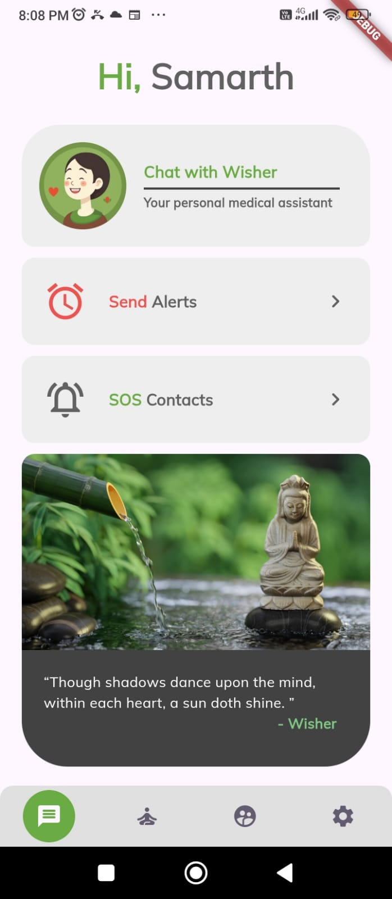
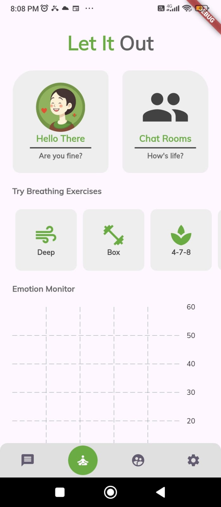
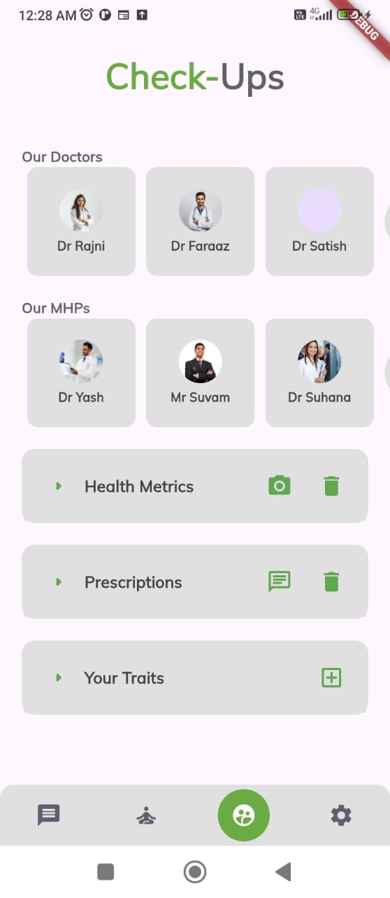
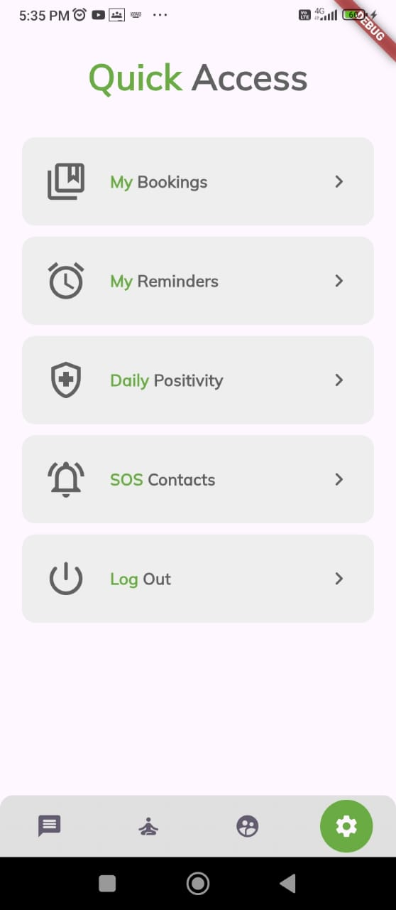
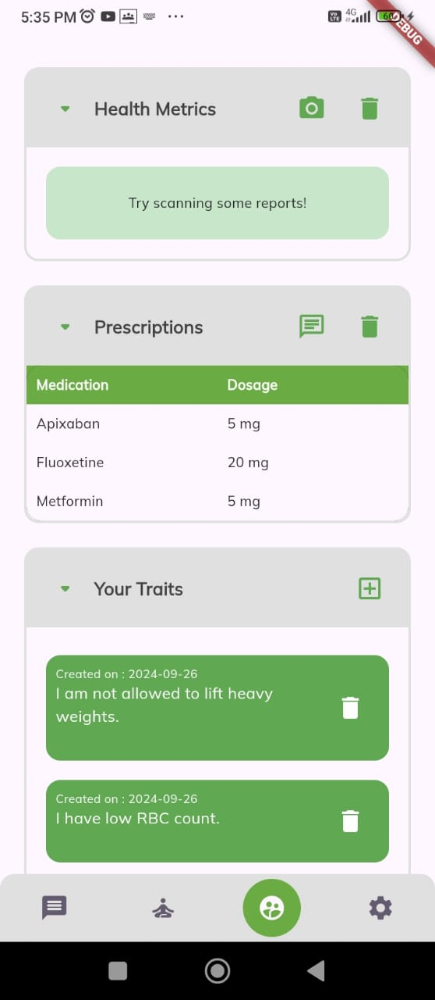
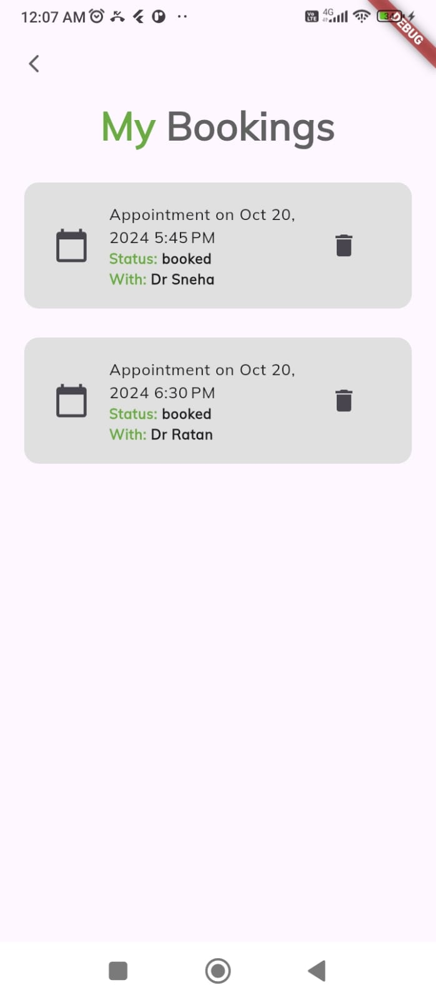
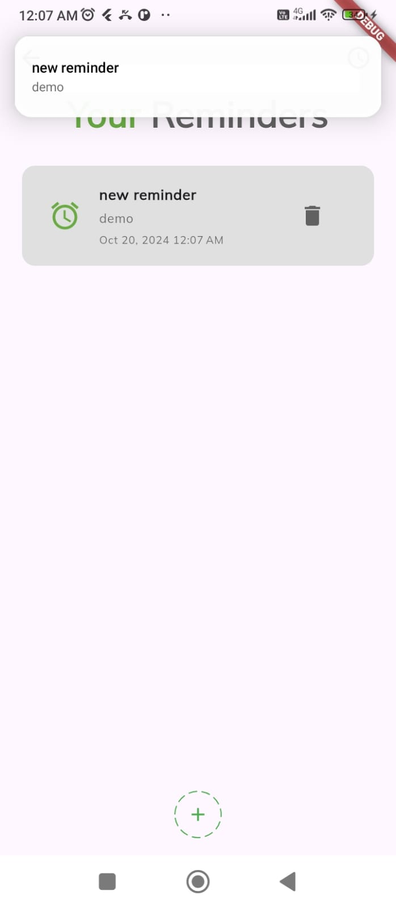

# Wellwish

**Wellwish** is a health-focused mobile application built using Flutter and Firebase. It integrates a variety of features such as a medical chatbot, appointment booking, SOS alerts, anonymous chatrooms, and more, designed to provide users with a seamless healthcare management experience.

## Features

- **Medical Chatbot**
  - Discuss symptoms and get medical advice.
  - Build personalized diet schedules.
  - The chatbot updates tables with user-provided information (e.g., prescribed medications, dietary restrictions).
  
- **Doctor and Mental Health Professional Directory**
  - Browse a database of healthcare professionals.
  - Book appointments with available doctors or mental health specialists based on their slots.

- **Reminder System**
  - Set reminders for medications, appointments, or any important tasks.

- **Emergency SOS Feature**
  - Triggers when the SOS button is pressed or if the device experiences a fall.
  - Sends an SMS with the user’s location to emergency contacts.

- **Anonymous Private Bot Sessions**
  - Private sessions with the chatbot for discussing sensitive issues.
  - Emotional chart feature to track and manage emotional well-being.

- **Anonymous Chatrooms**
  - Engage with other users anonymously, providing a space for community support.

- **Breathing Exercise Pages**
  - Helps users practice relaxation through guided breathing exercises.

- **User Authentication**
  - Secure login using Firebase with Google Authentication.

## Demonstration and Installation

- [Youtube Link](https://youtu.be/XzqdOyKBkNQ)

- [Prototype Application](https://drive.google.com/file/d/1247vhkbDaQaSwXYWBrM0C8RwTNPhAwk8/view?usp=sharing)

## Screenshots

## Packages Used

- **Core & UI**
  - `cupertino_icons: ^1.0.6`
  - `velocity_x: ^4.2.1`
  - `flutter_snake_navigationbar: ^0.6.1`

- **Chatbot & AI Integration**
  - `google_generative_ai: ^0.4.6`

- **Database & Authentication**
  - `firebase_core: ^3.4.0`
  - `firebase_auth: ^5.2.0`
  - `cloud_firestore: ^5.4.0`
  - `google_sign_in: ^6.2.1`

- **Emergency Features**
  - `geolocator: ^13.0.1`
  - `background_sms: ^0.0.4`
  - `sensors_plus: ^6.0.1`
  - `permission_handler: ^11.3.1`

- **Notifications & Reminders**
  - `flutter_local_notifications: ^17.2.2`
  - `timezone: ^0.9.4`
  - `workmanager: ^0.5.2`

- **UI/UX Enhancements**
  - `flutter_markdown: ^0.7.3+1`
  - `dotted_border: ^2.1.0`
  - `lottie: ^3.1.2`
  - `fl_chart: ^0.69.0`

- **Other Utilities**
  - `url_launcher: ^6.3.0`
  - `flutter_datetime_picker: ^1.5.0`
  - `shared_preferences: ^2.3.2`
  - `fluttertoast: ^8.0.9`
  - `speech_to_text: ^7.0.0`
  - `intl: ^0.19.0`
  - `image_picker: ^1.1.2`
  - `audioplayers: ^6.1.0`

